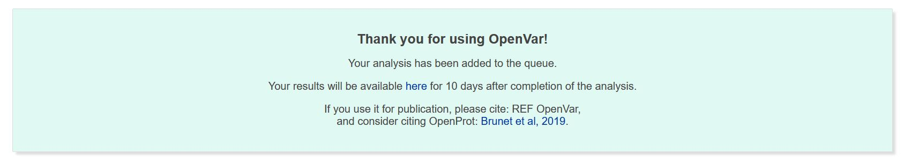
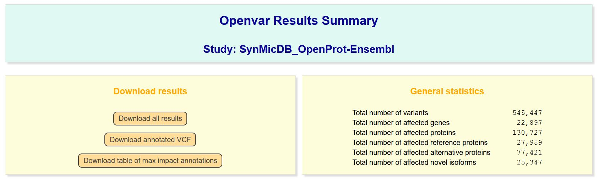
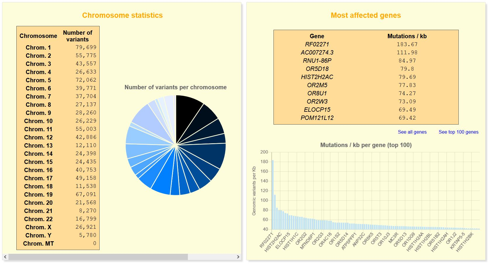
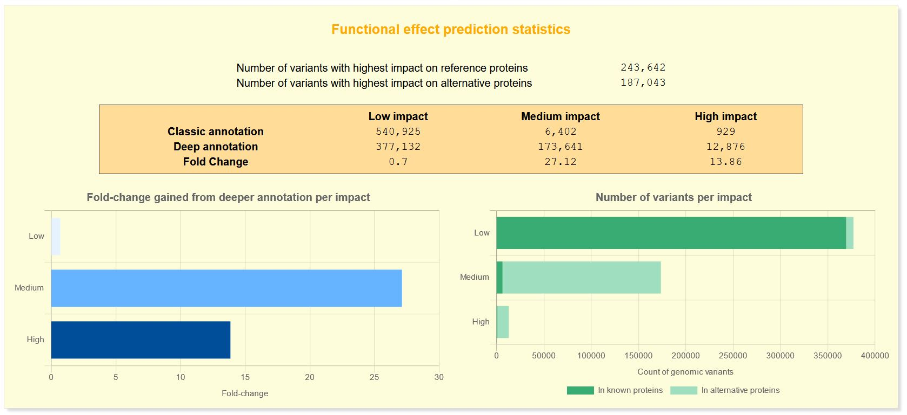
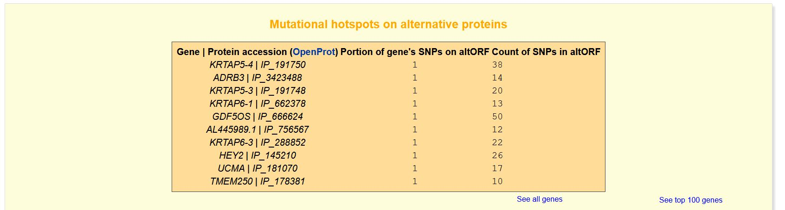
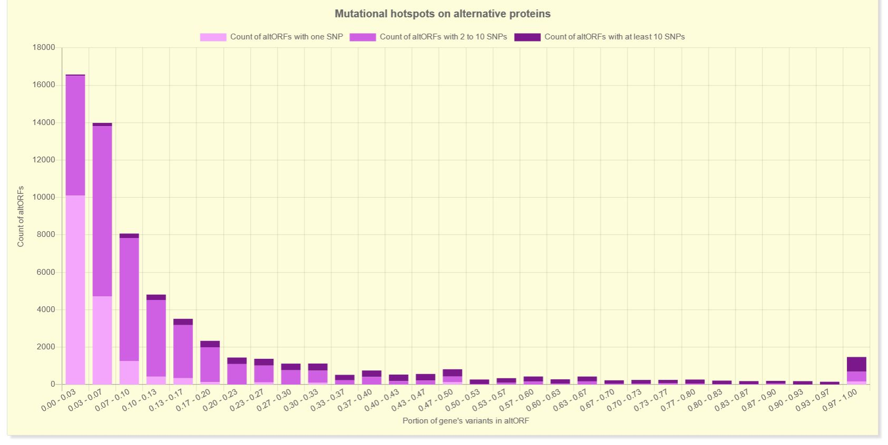

# OpenVar_WebApp

This is a repository containing the code of the OpenVar web-based platform. The platform uses the OpenVar python package, available at: https://github.com/MAB-Lab/OpenVar.

## Submitting an analysis to the OpenVar website

To submit an analysis, click on the **Run Analysis** tab on the menu bar. You should get to this page:

In the first two boxes, you are asked to enter an **email adress**, which will be used to send you a unique link to the results of your analysis; and a **study name**, which will be used to refer to your analysis.
Then, you are asked to select the adequate parameters for your analysis. As OpenVar starts from an unannotated VCF file, these parameters should be the one used to build the VCF file. You will have to select the species you are working with, the genome assembly used (please note the differences between hg38, hg19 and b37) and the genome build you wish to use to annotate your VCF file (common or deep genome annotation).

**Before clicking on "Run analysis"**, you have to upload your unannotated VCF file using the upload form at the bottom of your screen. A progress bar will appear and a message confirming the upload of your data will be displayed if the upload was completed successfully!

Once your analysis has been successfully submitted, a blue box will appear at the bottom of your screen. The link in this box is unique to your analysis and will be emailed to you once the analysis is done.

## Understanding the results

Once the analysis is done, you will receive an email with a link to your results.
The results page is organized in boxes, as follows.

### Downloading your results

First, you will see a box with 3 download links. You can either download all of your results as a zipped folder by clicking on **Download all results**, or download only the annotated VCF file or the table of maximal impacts for downstream analyses.

OpenVar output folder contains the following: 
  - The **submitted input vcf** (*input_vcf.vcf*).
  - A text file of all **analysis warnings** (*warnings.txt*). This file would contain all SNPs that were not included in the analysis and the reason why (e.g. none of the alleles match the allele of the reference genome at the given position: invalid alleles).
  - The usual **annotated vcf** (*unique_id.ann.vcf*).
  - A **tsv file listing all consequences for each variant** (*study_name_annOnePerLine.tsv*). This file would thus contain as many lines as there are consequences for all of the submitted variants. For example, a SNP altering a canonical ORF and an alternative ORF would have 2 lines, one listing the effect on the canonical ORF, the second listing the effect on the alternative ORF.
  - A **tsv file listing only the maximal impact on canonical and alternative ORFs for each variant** (*study_name_max_impact.tsv*). This file would thus contain as many lines as the number of submitted variants. For example, a SNP altering a canonical ORF and two alternative ORFs, the SNP line would contain the maximal impact for the canonical ORF alongside that of the highest impact on any of the alternative ORFs. Please note that the maximal impact is based on the SnpEff categorization in modifier, low, medium or high impact (for more information, you may want to consult the SnpEff documentation ). With this file, you always keep the effect on the canonical ORFs, but you also have the information gained from deeper annotation. In this file, two columns (ref_max_impact and alt_max_impact) are here to ease filtering in order to look at the variants with the highest impact in the alternative ORFs (alt_max_impact = 1). Please note that when the impact of the SNP is in the same category for the canonical ORF and the alternative ORF, both columns would be equal to 1 (ref_max_impact = 1 and alt_max_impact = 1).
  - **Figures**: the zipped folder includes 4 figures which are in .svg format to easily customize and include in publications. The figures consists of the top 100 mutated genes (*top_genes_var_rate.svg*), the number of variants per category of impact in canonical and alternative proteins (*var_per_impact.svg*), the fold-change for each impact category gained with deeper annotation (*impact_foldchange.svg*), and a barchart of the number of altORF per the percentage of genes' variants clustered on the altORF (*hotspots_barchart.svg*). For the last one, for example at the far right of the graph, you would have the number of alternative proteins each explaining all of the SNPs of the corresponding gene. They are divided in categories based on the total number of SNPs: only one SNP, one to ten SNPs, and more than ten SNPs.
  - A **pickle object** (*summary.pkl*) which contains all summary statistics needed to present the results on the web page in a python format. This should ease any downstream filtering you may want to perform. To load the pickle object into python, you can use the following commands: <code>import pickle</code> <code>summary_path = 'path/to/summary/pickle'</code> <code>pickle.load(open(summary_path, 'rb'))</code>

### General statistics

Next to the download links, you will find the general statistics.

For a detailed explanation of the terms reference protein, alternative protein and novel isoforms, please see the help of OpenProt, .

### Chromosome and Gene statistics

Under the download links, you will find statistics per chromosome or per gene.

Please note that the graphics are interactive: by hovering your mouse, detailed information will appear.

### Statistics if a deep ORF annotation was used

#### Functional effect prediction

These statistics aim to emphasize the difference brought by the use of a deep genome annotation.

#### Mutational hotspots on alternative proteins

This table and graph aim to help in the selection of promising candidates.
The table lists alternative proteins based on the portion of the gene's variants at its locus and the total count of variants at its locus. The table is ranked based on the mean impact of all variants per alternative proteins.

The graph complements the table with picturing the number of altORF per the percentage of genes' variants clustered on the altORF. For example at the far right of the graph, you would have the number of alternative proteins each explaining all of the SNPs of the corresponding gene. They are divided in categories based on the total number of SNPs: only one SNP, one to ten SNPs, and more than ten SNPs.

## Help

If you have any questions regarding OpenVar, please don't hesitate to .

### Input file format
The expected input format is a Variant Call Format ([VCF](https://samtools.github.io/hts-specs/VCFv4.2.pdf). It is the de facto standard file format for genomic variants. Other formats should be converted to a VCF format, below are a few examples to run on a shell.
#### BED files
BED input files can be converted using [PLINK](https://www.cog-genomics.org/plink/) with the following command:
<code>plink --bfile [filename] --recode vcf --out [vcf name]</code>
#### dbSNP identifiers
In order to produce a VCF input from a list of dbSNP identifiers, download the VCF file containing all variants within dbSNP [here](https://ftp.ncbi.gov/snp/organisms/human_9606/VCF/)
Then use the following command: <code>grep -wFf dbsnp_id_list.txt my_vcf.vcf > /path_to_output_folder</code>

