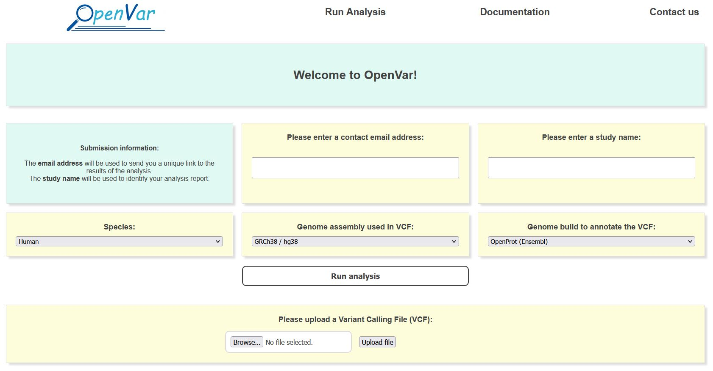

# OpenVar_WebApp

This is a repository containing the code of the OpenVar web-based platform. The platform uses the OpenVar python package, available at: https://github.com/MAB-Lab/OpenVar.

## Submitting an analysis to the OpenVar website

To submit an analysis, click on the **Run Analysis** tab on the menu bar. You should get to this page:

In the first two boxes, you are asked to enter an **email adress**, which will be used to send you a unique link to the results of your analysis; and a **study name**, which will be used to refer to your analysis.
Then, you are asked to select the adequate parameters for your analysis. As OpenVar starts from an unannotated VCF file, these parameters should be the one used to build the VCF file. You will have to select the species you are working with, the genome assembly used (please note the differences between hg38, hg19 and b37) and the genome build you wish to use to annotate your VCF file (common or deep genome annotation).

**Before clicking on "Run analysis"**, you have to upload your unannotated VCF file using the upload form at the bottom of your screen. A progress bar will appear and a message confirming the upload of your data will be displayed if the upload was completed successfully!

